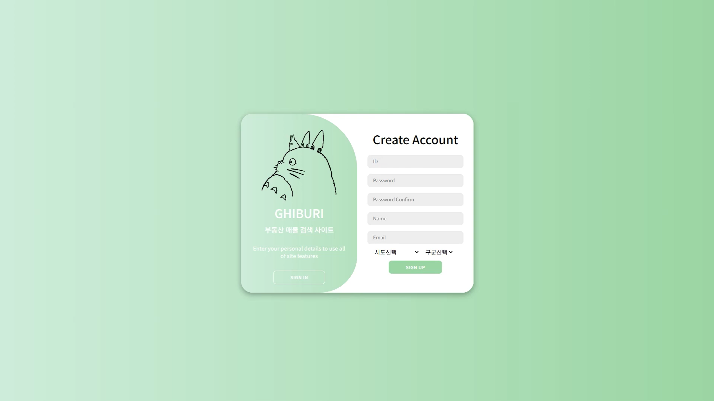

<h1>집우리 - GHIBURI [2023]</h1>

카카오 지도 API와 아파트 매매 실거래 자료 API를 활용한 부동산 웹 플랫폼

## 🙋‍♂️ Distributed Roles

### BACKEND

#### 박재선 (팀장)

### FRONTEND

#### 엄세현

- 프론트엔드
- 페이지 디자인
- 초기 개발 환경 구축
- 공지사항 페이지 제작
- 커뮤니티 페이지 제작
- 지도 페이지 제작
- 뉴스 페이지 제작
- 로그인, 회원가입 페이지 제작
- 마이페이지 제작
- Axios 전역화 및 연동
- 비 로그인 라우팅 기능
- 카카오 지도 API

 

 

### 📢 Site Layout

### 메인

 
### 로그인 / 회원가입

### 커뮤니티

### 지도

### 매물 상세

### 매물 비교

## ⚙️ Function

### 회원

💡 회원은 Session를 사용하여 로그인 구현

- [x] 회원가입
- [x] 로그인
- [x] 로그아웃
- [x] 회원 탈퇴
- [x] 닉네임 중복 검사
- [x] 아이디 중복 검사

### 마이 페이지

💡 개인 정보, 최근 조회 정보, 찜목록 구현

- [x] 개인 정보 조회
- [x] 최근 확인 매물 조회
- [x] 찜한 매물 조회

### 메인 페이지

💡 즉각적인 부동산 검색과 추천, 공지사항과 뉴스 구현

- [x] 필터링 검색
- [x] 로그인한 사용자에 따른 부동산 개별 추천
- [x] 공지사항 요약
- [x] 뉴스 요약

### 공지사항

💡 공지사항 구현

- [x] 관리자만 가능한 공지사항 추가, 수정, 삭제
- [x] 사용자 공지사항 조회 가능

### 커뮤니티

💡 모든 사용자가 작성 가능한 커뮤니티 구현

- [x] 로그인한 모든 사용자 게시글 추가, 수정, 삭제 가능
- [x] 비로그인 사용자도 조회 가능
- [x] 작성한 본인만이 수정, 삭제 가능

### 뉴스

💡 최근 뉴스 테이블 구현

- [x] 크롤링을 통한 최신 뉴스 제공

### 지도

💡 카카오 API를 이용한 지도 구현

- [x] 부동산 검색 기능
- [x] 지역 매물 클러스터링 기능
- [x] 지역 편의시설 필터 기능

### 매물 상세 페이지

💡 검색을 통한 매물 상세 정보 페이지 구현

- [x] 아파트 정보 제공
- [x] 찜 기능
- [x] 카카오 API와 연동된 로드뷰 제공

### 매물 비교 페이지

💡 선택한 매물과 다른 근처 매물 비교 기능 구현

- [x] 두 아파트의 정보 제공
- [x] 면적, 면적당 가격, 완공 년도 정보를 비교

## 최종 결과 영상

